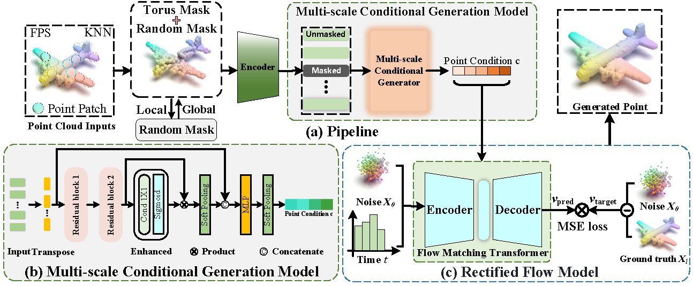

# PointFM

## PointFM: Point Cloud Understanding by Flow Matching

##abstract
Probabilistic path models have significantly improved generative tasks in computer vision. Researchers use diffusion model as 3D pretrained decoder, learning representation by predicting noise during the forward diffusion process. However, this method requires noise addition and denoising operations throughout the entire point cloud, leading to high computational costs, inefficient training processes, and increased optimization complexity. To address these challenges, this paper proposes a novel point cloud representation learning method based on Continuous Normalizing Flows(CNFs), named PointFM, which introduces a straightforward and easy-to-train Rectified Flow Matching for the first time. Overall, PointFM utilizes sparse point cloud as target samples and optimizes the flow relationship between Gaussian distribution and target distribution along optimal transport path. In terms of conditional generation, we propose a Hybrid Torus Mask and Multi-scale Conditional Generation Model during the encoding process, which enhances multi-scale feature interaction and improves representation capability. PointFM offers superior training efficiency and lower complexity compared to other generative methods, achieving strong performance on various downstream tasks, with average gains of 5.12\% and 2.07\% over PointMAE and PointDiff on ScanObjectNN.

<div  align="center">    
 
</div>


## 1. Installation
PyTorch >= 1.10.0;
python >= 3.7.12;
CUDA >= 11.1;

```
pip install -r requirements.txt
```

```
# PointNet++
pip install "git+https://github.com/erikwijmans/Pointnet2_PyTorch.git#egg=pointnet2_ops&subdirectory=pointnet2_ops_lib"

# GPU kNN
pip install --upgrade https://github.com/unlimblue/KNN_CUDA/releases/download/0.2/KNN_CUDA-0.2-py3-none-any.whl

#chamfer
cd ./chamfer_dist 
python setup.py install --user

# SoftPool
git clone https://github.com/alexandrosstergiou/SoftPool.git
cd SoftPool-master/pytorch
make install
```

## 2. Data Preparation

We use ShapeNet, ScanObjectNN, ScanNet, and S3DIS in this work. See [DATASET.md](./DATASET.md) for details.


## 3. PointFM pre-training

Run the following command to pre-train the PointFM model on ShapeNet:
```
CUDA_VISIBLE_DEVICES=<GPUs> python pointfm_main.py --config cfgs/pretrain.yaml --exp_name <output_file_name>
```

## 5. PointFM fine-tuning
Run the following command to fine-tunine the PointDif model on ScanObjectNN:
```
CUDA_VISIBLE_DEVICES=<GPUs> python pointfm_main.py --config cfgs/finetune_scan_hardest.yaml --finetune_model --exp_name <output_file_name> --ckpts <path/to/pre-trained/model>
CUDA_VISIBLE_DEVICES=<GPUs> python pointfm_main.py --config cfgs/finetune_scan_objbg.yaml --finetune_model --exp_name <output_file_name> --ckpts <path/to/pre-trained/model>
CUDA_VISIBLE_DEVICES=<GPUs> python pointfm_main.py --config cfgs/finetune_scan_objonly.yaml --finetune_model --exp_name <output_file_name> --ckpts <path/to/pre-trained/model>
